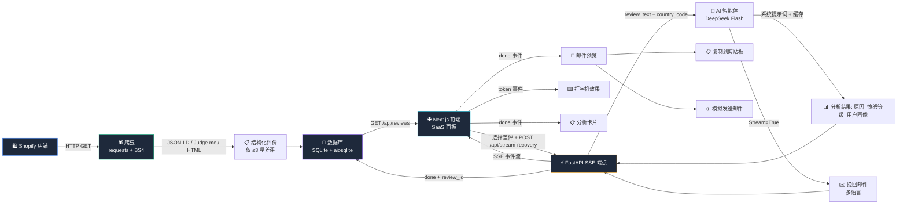

<p align="right">
  <a href="README.md">🇬🇧 English</a>
</p>

<p align="center">
  
  
  
  
  
  
  
  <br />
  
  
</p>

<h1 align="center">🛡️ RatingGuard</h1>
<h3 align="center">AI 驱动的跨境电商差评挽回系统</h3>

<p align="center">
  自动检测来自 <b>Shopify</b> / <b>Amazon</b> 店铺的差评，
  使用 <b>DeepSeek</b> 大语言模型分析根因，
  生成符合目标市场文化的挽回邮件 —— 实时流式传输到精美的 <b>Next.js</b> SaaS 面板。
  <br />
  <b>让愤怒的客户重新成为忠实顾客。完全开源。</b>
</p>

<p align="center">
  <a href="#-核心功能">✨ 核心功能</a> •
  <a href="#-架构与数据流">🏗️ 架构</a> •
  <a href="#-技术栈">🛠️ 技术栈</a> •
  <a href="#-快速开始">🚀 快速开始</a> •
  <a href="#-项目结构">📂 项目结构</a> •
  <a href="#-api-参考">📡 API 参考</a> •
  <a href="#-许可证">📄 许可证</a>
</p>

---

<h2 id="-核心功能">✨ 核心功能</h2>

<table>
  <tr>
    <td width="50%">
      <h4>🤖 差评输入</h4>
      两种方式获取差评：<b>自动爬取</b> Shopify 店铺（JSON-LD / Judge.me / HTML，无需 API Key），或从任意平台<b>手动粘贴</b>（亚马逊、虾皮、TikTok 等）。自动过滤 ≤3 星差评。
    </td>
    <td width="50%">
      <h4>🧠 AI 根因分析</h4>
      由 <b>DeepSeek-V4 Flash</b> 驱动，支持提示词缓存。将投诉分为 9 大类别（物流延迟、产品质量、尺码问题、破损等），并评估客户愤怒等级（1-5 级）。
    </td>
  </tr>
  <tr>
    <td>
      <h4>🌍 多语言挽回邮件</h4>
      生成符合文化习惯、合规安全的 <b>11 种语言</b> 挽回邮件（美式/英式英语、日语敬语、德语 Sie-形式、法语 vous、韩语 존댓말 等）。包含 <code>[Customer Name]</code> 和 <code>[Discount Code]</code> 占位符。
    </td>
    <td>
      <h4>⚡ 实时 SSE 流式传输</h4>
      通过 Server-Sent Events <b>逐字符</b> 观看 AI 撰写挽回邮件。基于 FastAPI <code>StreamingResponse</code> + <code>AsyncOpenAI</code> —— 无需轮询，无需等待。
    </td>
  </tr>
  <tr>
    <td>
      <h4>🛡️ 合规护栏</h4>
      XML 标签化的系统提示词确保平台安全用语。绝不建议"退款换删评"。所有输出均为纯 JSON，解析失败时自动降级。
    </td>
    <td>
      <h4>🎨 现代 SaaS 面板</h4>
      深色主题、响应式 UI，基于 <b>Next.js 14 App Router</b> 和 <b>Tailwind CSS</b> 构建。评价列表 + 实时分析双栏布局，骨架屏加载状态，一键复制，模拟发送。
    </td>
  </tr>
</table>

---

<h2 id="-技术栈">🛠️ 技术栈</h2>

<table>
  <tr>
    <th align="center">后端</th>
    <th align="center">前端</th>
    <th align="center">AI 引擎</th>
  </tr>
  <tr>
    <td valign="top">
      <ul>
        <li><b>FastAPI</b> 0.115 — 异步 Web 框架</li>
        <li><b>Uvicorn</b> — ASGI 服务器</li>
        <li><b>Requests</strong> + <strong>BeautifulSoup4</b> — Shopify 爬虫</li>
        <li><b>Pydantic</b> V2 — 数据建模与验证</li>
        <li><b>aiosqlite</b> — 异步 SQLite 持久化</li>
        <li><b>OpenAI SDK</b> — DeepSeek API 客户端</li>
        <li><b>python-dotenv</b> — 环境变量管理</li>
      </ul>
    </td>
    <td valign="top">
      <ul>
        <li><b>Next.js</b> 14 — App Router (React 18)</li>
        <li><b>TypeScript</b> 5 — 严格模式</li>
        <li><b>Tailwind CSS</b> 3.4 — 工具类优先样式</li>
        <li><b>自定义 SSE Hook</b> — <code>useRecoveryStream</code></li>
        <li><b>Fetch API</b> + <code>ReadableStream</code> — 流式消费者</li>
      </ul>
    </td>
    <td valign="top">
      <ul>
        <li><b>DeepSeek-V4 Flash</b> — 主 LLM</li>
        <li><b>LLMDriver</b> 适配器模式 — 可自由切换 GPT-4o / Claude / DeepSeek</li>
        <li><b>结构化系统提示词</b> — XML 标签化，抗注入</li>
        <li><b>提示词缓存</b> — 降低延迟与成本</li>
        <li><b>9 类别</b> 根因分类器</li>
        <li><b>11 国</b> 本地化映射表</li>
      </ul>
    </td>
  </tr>
</table>

---

<h2 id="-架构与数据流">🏗️ 架构与数据流</h2>



### 处理流水线

| 步骤 | 组件 | 说明 |
|------|------|------|
| **① 输入** | `page.tsx` — `ManualReviewForm` | 从任意平台粘贴差评文本，或从 Shopify URL 爬取 |
| **② 爬取** | `scraper.py` | 获取产品页面 HTML，依次尝试 3 种策略（JSON-LD → Judge.me → 通用 HTML） |
| **③ 过滤** | `scraper.py` | 仅保留 ≤3 星的评价，按评分升序排列 |
| **④ 存储** | `scrape_routes.py` + `database.py` | 将评价写入 SQLite，按（用户名、内容、商品）去重 |
| **⑤ 分析** | `main.py` + `ai_agent.py` | 将评价发送至 DeepSeek，附带 XML 标签化系统提示词 + 目标国家本地化指令 |
| **⑥ 流式传输** | `main.py` | FastAPI `StreamingResponse` 将每个 LLM delta token 转发为 SSE 事件 |
| **⑦ 展示** | `page.tsx` | `useRecoveryStream` hook 解析 SSE 事件，渲染打字机动画，展示结构化结果 |
| **⑧ 持久化** | `main.py` + `database.py` | 流完成后，将分析结果保存到 `analyses` 表 |
| **⑨ 操作** | `ActionBar` | 复制邮件到剪贴板或触发模拟发送 |

---

<h2 id="-快速开始">🚀 快速开始</h2>

### 环境要求

- Python **3.11+**
- Node.js **18+**
- DeepSeek API 密钥（[在此申请](https://platform.deepseek.com/api_keys)）

### 1. 克隆与配置

```bash
git clone https://github.com/2jy89j6f28-cmyk/ratingguard.git
cd ratingguard

# 创建环境变量文件
cp .env.example .env
# └─ 编辑 .env：填入 DEEPSEEK_API_KEY、SHOPIFY_STORE_DOMAIN
```

### 2. 安装依赖

```bash
# 后端
pip install -r backend/requirements.txt

# 前端
cd frontend && npm install && cd ..
```

### 3. 启动后端服务器

```bash
python -m backend.main
# → FastAPI 运行于 http://localhost:8000
# → Swagger 文档位于 http://localhost:8000/docs
```

### 4. 启动前端开发服务器

```bash
cd frontend
npm run dev
# → Next.js 运行于 http://localhost:3000
```

### 5. 打开面板

在浏览器中打开 **http://localhost:3000**，选择输入方式：

- **🔗 抓取** — 输入 Shopify 商品 URL 自动获取评价
- **✏️ 手动输入** — 从任意平台直接粘贴差评文本

选择一条差评（或提交手动输入），观看 AI 实时生成挽回邮件。

### 配置参考

| 环境变量 | 必填 | 默认值 | 说明 |
|---------|------|--------|------|
| `SHOPIFY_STORE_DOMAIN` | ✅ | — | 你的 Shopify 店铺域名（如 `mystore.myshopify.com`） |
| `DEEPSEEK_API_KEY` | ✅ | — | DeepSeek API 密钥 |
| `DEEPSEEK_MODEL_NAME` | ❌ | `deepseek-chat` | 模型标识符 |
| `DEEPSEEK_BASE_URL` | ❌ | `https://api.deepseek.com/v1` | API 端点基础 URL |
| `OPENAI_API_KEY` | ❌ | — | 备选：使用 GPT-4o 的 OpenAI 密钥 |
| `LOG_LEVEL` | ❌ | `INFO` | 日志级别（`DEBUG`, `INFO`, `WARNING`） |
| `SCRAPER_REQUEST_DELAY_MIN` | ❌ | `2.0` | 请求最小延迟（秒） |
| `SCRAPER_REQUEST_DELAY_MAX` | ❌ | `5.0` | 请求最大延迟（秒） |
| `DATABASE_PATH` | ❌ | `ratingguard.db` | SQLite 数据库文件路径 |
| `CORS_ORIGINS` | ❌ | `http://localhost:3000` | 逗号分隔的允许 CORS 来源 |

### Docker 部署（生产环境）

```bash
# 1. 构建并启动所有服务
docker-compose up --build

# 2. 打开面板
#    → http://localhost:3000

# 3. 停止并清理
docker-compose down -v
```

Docker 配置包含：
- **后端** — Python 3.11-slim，Uvicorn 多进程，健康检查探针
- **前端** — Node 20-alpine，Next.js standalone 构建，生产优化
- **持久化卷** — SQLite 数据在容器重启后不丢失
- **网络** — Docker 内部网络，前端自动代理 `/api/*` 到后端

---

<h2 id="-项目结构">📂 项目结构</h2>

```
ratingguard/
├── backend/
│   ├── main.py                  # FastAPI 应用 — SSE 流式端点 + 健康检查
│   ├── config.py                # 集中式 .env → 冻结数据类（单一事实来源）
│   ├── database.py              # 异步 SQLite 持久化层（商品/评价/分析 三表）
│   ├── scrape_routes.py         # POST /api/scrape — 触发爬虫抓取差评
│   ├── review_routes.py         # GET /api/reviews — 评论列表与详情 API
│   ├── logger.py                # 双输出日志器（控制台 + 文件）
│   ├── scraper.py               # Shopify 评价爬虫 — 3 策略解析，反爬保护
│   ├── ai_agent.py              # DeepSeek AI 智能体 — 系统提示词，流式客户端
│   ├── requirements.txt
│   ├── ai_chain/                # 可插拔 LLM 架构（社区可扩展）
│   │   ├── base.py              #   抽象 LLMDriver 接口
│   │   ├── openai_driver.py     #   GPT-4o 实现
│   │   ├── deepseek_driver.py   #   DeepSeek 实现
│   │   ├── prompts.py           #   所有提示词模板
│   │   └── parser.py            #   JSON 提取 + 验证
│   └── utils/
│       ├── helpers.py           #   UA 池、重试装饰器、速率限制器
│
├── frontend/
│   ├── src/
│   │   ├── app/
│   │   │   ├── page.tsx         # 主面板 — 双栏布局（评价列表 + 挽回面板）
│   │   │   ├── layout.tsx       # 根布局（深色模式）
│   │   │   └── globals.css      # 全局样式 + 骨架屏 + 光标动画
│   │   ├── hooks/
│   │   │   ├── useRecoveryStream.ts  # SSE 流式 React Hook
│   │   │   └── useReviews.ts         # 评价状态管理（抓取/加载/选择）
│   │   └── lib/
│   │       └── api.ts               # 统一 API 客户端
│   ├── package.json
│   ├── tailwind.config.ts       # 自定义深色 SaaS 主题
│   └── next.config.js           # API 代理转发 → localhost:8000
│
├── Dockerfile.backend           # Python 3.11-slim Docker 镜像
├── Dockerfile.frontend          # Node 20-alpine 多阶段构建
├── docker-compose.yml           # 后端 + 前端 + 持久化卷
├── .env.example                 # 环境变量模板（所有键均有说明）
├── .gitignore
├── LICENSE                      # MIT 许可证
├── README.md                    # 英文说明文档
└── README.zh-CN.md              # 中文说明文档
```

---

<h2 id="-api-参考">📡 API 参考</h2>

### `POST /api/stream-recovery`

分析一条差评并实时流式传输挽回邮件。

**请求体：**

```json
{
  "review_text": "The bag arrived with a broken zipper",
  "country_code": "US",
  "customer_name": "Sarah",
  "rating": 2,
  "product_title": "Leather Backpack"
}
```

**响应 — SSE 事件流：**

```
data: {"type":"token","content":"{"}
data: {"type":"token","content":"\n  "}
data: {"type":"token","content":"\"reason"}
...
data: {"type":"done","result":{
  "reason_category": "damaged_defective",
  "anger_level": 4,
  "customer_persona": {
    "communication_style": "direct",
    "cultural_traits": "expects prompt resolution",
    "suggested_approach": "..."
  },
  "recovery_email": {
    "subject": "We're so sorry about the zipper, Sarah",
    "body": "Dear [Customer Name],\n\nI'm truly sorry to hear...",
    "language": "en"
  }
}}
```

| 事件类型 | 触发时机 | 内容 |
|---------|---------|------|
| `token` | 每个 LLM delta | `content`：部分文本块 |
| `done` | 流式传输完成 | `result`：完整结构化分析 + 邮件 |
| `error` | API/配置错误 | `message`：错误描述 |

### `POST /api/scrape`

触发爬虫抓取指定商品 URL 的评论，结果存入数据库。

**请求体：**

```json
{ "product_url": "https://example.myshopify.com/products/product-handle" }
```

**响应：**

```json
{
  "status": "success",
  "product_id": 1,
  "reviews_count": 12,
  "message": "成功抓取 12 条差评"
}
```

### `GET /api/reviews`

获取已抓取的差评列表（分页，仅 ≤3 星）。

| 查询参数 | 类型 | 默认值 | 说明 |
|---------|------|--------|------|
| `product_id` | int | — | 按商品过滤 |
| `limit` | int | `50` | 每页条数（最大 200） |
| `offset` | int | `0` | 分页偏移 |

### `GET /api/reviews/{id}`

获取单条评论及其 AI 分析结果（如有）。

### `GET /health`

```json
{ "status": "ok", "database": "connected", "model": "deepseek-chat", "shopify_domain": "..." }
```

---

<h2 id="-扩展添加新的-llm">🔌 扩展：添加新的 LLM</h2>

RatingGuard 的 AI 链采用**策略模式** —— 添加一个新模型只需 3 步：

```python
# 1. 在 backend/ai_chain/ 中创建新的驱动
class ClaudeDriver(LLMDriver):
    def chat(self, messages, **kwargs) -> str: ...
    async def chat_async(self, messages, **kwargs) -> str: ...
    @property
    def model_name(self) -> str: ...

# 2. 在 .env 中添加你的 API 密钥
# 3. 注入到 ReviewAgent： agent = ReviewAgent(client=ClaudeDriver())
```

系统提示词、少样本示例、JSON 解析器和验证层全部**保持不变**。

---

<h2 id="-路线图">🗺️ 路线图</h2>

- [x] Shopify 评价爬虫（3 种解析策略）
- [x] DeepSeek AI 集成与流式传输
- [x] 多语言挽回邮件（11 个区域）
- [x] SSE 实时 SaaS 面板
- [x] SQLite 持久化存储（商品 / 评价 / 分析）
- [x] Docker 一键部署（docker-compose、多阶段构建）
- [ ] Amazon 评价爬取支持
- [ ] 批量评价处理与定时调度
- [ ] OAuth / JWT 身份认证
- [ ] Webhook 集成（Slack、邮件）
- [ ] 挽回邮件 A/B 效果测试
- [ ] 数据分析面板（挽回率、回复指标）

---

<h2 id="-贡献指南">🤝 贡献指南</h2>

开源社区之所以伟大，正是因为每个人的贡献。我们**热忱欢迎**任何想法、错误报告或 Pull Request。

1. Fork 本项目
2. 创建你的特性分支（`git checkout -b feature/amazing-idea`）
3. 提交你的修改（`git commit -m 'Add some amazing feature'`）
4. 推送到分支（`git push origin feature/amazing-idea`）
5. 提交 Pull Request

---

<h2 id="-许可证">📄 许可证</h2>

基于 **MIT 许可证** 发布。详见 [`LICENSE`](LICENSE) 文件。

---

<p align="center">
  <b>为跨境电商卖家打造 —— 不让任何一条差评白白流失客户。</b>
  <br />
  <a href="https://github.com/2jy89j6f28-cmyk/ratingguard/issues">报告 Bug</a>
  ·
  <a href="https://github.com/2jy89j6f28-cmyk/ratingguard/issues">请求功能</a>
</p>
